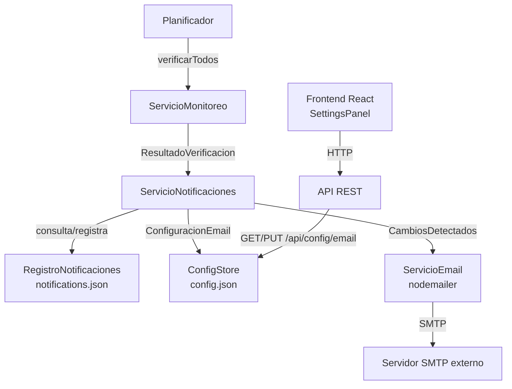

# Documento de Diseño: Notificaciones por Correo Electrónico

## Visión General

Se agrega al sistema de monitoreo de servidores un mecanismo de notificaciones por correo electrónico. Cuando el ciclo de monitoreo detecta un cambio de estado en un servidor, puerto o URL, el sistema envía un correo HTML profesional a los destinatarios configurados. Cada cambio se notifica exactamente una vez, usando un registro persistente de deduplicación.

La funcionalidad se integra al backend TypeScript/Node.js existente sin modificar la lógica central de monitoreo, y expone nuevos endpoints REST para gestionar la configuración desde el frontend React.

---

## Arquitectura



El flujo principal es:
1. `Planificador` dispara `verificarTodos` en `ServicioMonitoreo`
2. `ServicioMonitoreo` llama a `ServicioNotificaciones.procesarResultado(antes, despues)`
3. `ServicioNotificaciones` detecta cambios, consulta `RegistroNotificaciones`, filtra duplicados
4. Los cambios nuevos se pasan a `ServicioEmail` que construye y envía el correo HTML
5. `RegistroNotificaciones` persiste los cambios notificados

---

## Componentes e Interfaces

### ServicioNotificaciones

Orquesta la detección de cambios y el envío de notificaciones.

```typescript
interface CambioEstado {
  recursoId: string;
  tipoRecurso: 'servidor' | 'puerto' | 'url';
  nombreRecurso: string;
  estadoAnterior: string;
  estadoNuevo: string;
  timestamp: string; // ISO 8601
  servidorId: string;
  servidorNombre: string;
}

class ServicioNotificaciones {
  constructor(
    private store: ConfigStore,
    private registroNotificaciones: RegistroNotificaciones,
    private servicioEmail: ServicioEmail
  ) {}

  async procesarResultado(
    servidorAntes: Servidor,
    resultado: ResultadoVerificacion
  ): Promise<void>;

  private detectarCambios(
    servidorAntes: Servidor,
    resultado: ResultadoVerificacion
  ): CambioEstado[];
}
```

### RegistroNotificaciones

Persiste en `backend/data/notifications.json` los cambios ya notificados.

```typescript
interface EntradaNotificacion {
  claveDeduplicacion: string; // `${recursoId}:${estadoAnterior}:${estadoNuevo}`
  timestamp: string;
}

class RegistroNotificaciones {
  constructor(private filePath: string) {}

  yaNotificado(cambio: CambioEstado): boolean;
  registrar(cambio: CambioEstado): void;
  private cargar(): void;
  private guardar(): void;
}
```

La clave de deduplicación es: `${recursoId}:${estadoAnterior}:${estadoNuevo}`

Cuando el estado de un recurso cambia a un tercer valor (ej: `ok → alerta → ok`), la segunda transición (`alerta → ok`) tiene una clave diferente a la primera (`ok → alerta`), por lo que se notifica correctamente.

### ServicioEmail

Construye el HTML y despacha el correo usando `nodemailer`.

```typescript
class ServicioEmail {
  constructor(private store: ConfigStore) {}

  async enviarNotificacion(cambios: CambioEstado[]): Promise<void>;
  construirHtml(cambios: CambioEstado[]): string;
  private crearTransporte(): nodemailer.Transporter;
}
```

### ConfigStore (extensión)

Se extiende `ConfiguracionCompleta` con la sección de email:

```typescript
interface ConfiguracionEmail {
  habilitado: boolean;
  smtpHost: string;
  smtpPuerto: number;
  smtpUsuario: string;
  smtpPassword: string;
  remitente: string;
  destinatarios: string[]; // mínimo 1 dirección válida
}

// Agregado a ConfiguracionCompleta:
interface ConfiguracionCompleta {
  configuracion: ConfiguracionApp;
  servidores: Servidor[];
  email?: ConfiguracionEmail; // opcional para retrocompatibilidad
}
```

Nuevos métodos en `ConfigStore`:
```typescript
obtenerConfiguracionEmail(): ConfiguracionEmail | undefined;
actualizarConfiguracionEmail(config: ConfiguracionEmail): ConfiguracionEmail;
```

### API REST (nuevos endpoints)

| Método | Ruta | Descripción |
|--------|------|-------------|
| GET | `/api/config/email` | Retorna la configuración de email (sin contraseña en texto plano) |
| PUT | `/api/config/email` | Actualiza la configuración de email |
| POST | `/api/config/email/test` | Prueba la conexión SMTP con la configuración actual; retorna `{ ok: boolean, mensaje: string }` |

### Frontend: Panel de Configuración

Se agrega una sección "Notificaciones por Email" al `SettingsPanel` existente con:
- Toggle para habilitar/deshabilitar
- Campos: SMTP Host, Puerto, Usuario, Contraseña, Remitente
- Lista de destinatarios con botón agregar/eliminar por ítem
- Botón "Probar conexión" que llama a `POST /api/config/email/test` y muestra el resultado (éxito o error) en la UI

---

## Modelos de Datos

### config.json (extensión)

```json
{
  "configuracion": { "intervaloMonitoreoSegundos": 60 },
  "servidores": [...],
  "email": {
    "habilitado": true,
    "smtpHost": "smtp.example.com",
    "smtpPuerto": 587,
    "smtpUsuario": "monitor@example.com",
    "smtpPassword": "secret",
    "remitente": "Monitor Servidores <monitor@example.com>",
    "destinatarios": ["admin@example.com", "ops@example.com"]
  }
}
```

### notifications.json

```json
{
  "notificaciones": [
    {
      "claveDeduplicacion": "sgl-logica-01:ok:alerta",
      "timestamp": "2025-01-15T10:30:00.000Z"
    }
  ]
}
```

### Plantilla HTML del correo

```
Asunto: [Monitor Servidores] 3 cambio(s) detectado(s) - 15/01/2025 10:30
```

El cuerpo HTML incluye:
- Encabezado con logo/título institucional y timestamp
- Tabla con columnas: Servidor, Recurso, Tipo, Estado Anterior → Estado Nuevo, Hora
- Colores de celda por estado:
  - Verde (`#d4edda`): `ok`, `disponible`, `abierto`
  - Rojo (`#f8d7da`): `alerta`, `no_disponible`, `cerrado`, `sin_respuesta`, `error_certificado`
  - Gris (`#e2e3e5`): `desconocido`
- Pie de página con nombre del sistema y aviso de no-responder

---

## Propiedades de Corrección

*Una propiedad es una característica o comportamiento que debe mantenerse verdadero en todas las ejecuciones válidas del sistema. Las propiedades sirven como puente entre las especificaciones legibles por humanos y las garantías de corrección verificables automáticamente.*

### Property 1: Deduplicación de notificaciones

*Para cualquier* cambio de estado de un recurso, si ese cambio ya fue registrado en el `RegistroNotificaciones` (misma clave `recursoId:estadoAnterior:estadoNuevo`), entonces `yaNotificado()` debe retornar `true`.

**Validates: Requirements 3.2, 3.3**

---

### Property 2: Registro persiste cambios notificados

*Para cualquier* cambio de estado válido, después de llamar a `registrar(cambio)`, una llamada subsecuente a `yaNotificado(cambio)` debe retornar `true`.

**Validates: Requirements 3.1, 3.2**

---

### Property 3: Cambios distintos no son deduplicados

*Para cualquier* par de cambios donde el estado anterior o el estado nuevo sean diferentes (misma clave de recurso pero diferente transición), `yaNotificado()` debe retornar `false` para el segundo cambio si solo el primero fue registrado.

**Validates: Requirements 3.4**

---

### Property 4: Detección correcta de cambios de servidor

*Para cualquier* servidor con un estado anterior y un resultado de verificación con estado diferente, `detectarCambios()` debe incluir exactamente un `CambioEstado` de tipo `servidor` para ese servidor.

**Validates: Requirements 2.1, 2.4**

---

### Property 5: Sin cambio no genera notificación

*Para cualquier* servidor donde el estado anterior es igual al estado nuevo en todos sus recursos (servidor, puertos y URLs), `detectarCambios()` debe retornar una lista vacía.

**Validates: Requirements 2.4**

---

### Property 6: El HTML del correo contiene la información de cada cambio

*Para cualquier* lista no vacía de `CambioEstado`, el HTML generado por `construirHtml()` debe contener el nombre del servidor, el tipo de recurso, el estado anterior y el estado nuevo de cada cambio.

**Validates: Requirements 4.2, 4.3**

---

### Property 7: Validación de destinatarios rechaza formatos inválidos

*Para cualquier* cadena que no cumpla el formato de correo electrónico RFC 5322, la función de validación debe retornar `false`.

**Validates: Requirements 1.2, 1.4**

---

## Manejo de Errores

| Escenario | Comportamiento |
|-----------|---------------|
| SMTP no responde (timeout 10s) | Log de error, no reintento en el ciclo actual |
| Credenciales SMTP inválidas | Log de error, no excepción no controlada |
| Prueba de conexión SMTP falla | HTTP 200 con `{ ok: false, mensaje: "..." }` descriptivo |
| `notifications.json` corrupto | Se reinicia el archivo vacío, log de advertencia |
| `email` ausente en `config.json` | Notificaciones deshabilitadas silenciosamente |
| `ServicioNotificaciones` lanza excepción | `Planificador` captura y loguea, continúa el ciclo |
| Lista de destinatarios vacía al guardar | HTTP 400 con mensaje descriptivo |
| Dirección de correo con formato inválido | HTTP 400 indicando la dirección inválida |

---

## Estrategia de Testing

### Tests unitarios (Jest - backend)

- `RegistroNotificaciones`: carga/guarda, deduplicación, manejo de archivo corrupto
- `ServicioNotificaciones.detectarCambios`: casos de cambio de servidor, puerto, URL; sin cambio; primera verificación
- `ServicioEmail.construirHtml`: presencia de datos en HTML, colores por estado
- Validación de emails: formatos válidos e inválidos
- `ConfigStore`: nuevos métodos de email

### Tests de propiedades (Jest + fast-check)

Se usa `fast-check` como librería de property-based testing. Cada test ejecuta mínimo 100 iteraciones.

- **Property 1 & 2**: Generar cambios aleatorios, registrar, verificar `yaNotificado` retorna `true`
- **Property 3**: Generar dos cambios con diferente transición, registrar solo el primero, verificar que el segundo no está deduplicado
- **Property 4**: Generar servidores con estados distintos, verificar que `detectarCambios` produce exactamente un cambio de tipo servidor
- **Property 5**: Generar servidores donde estado anterior = estado nuevo, verificar lista vacía
- **Property 6**: Generar listas de cambios aleatorios, verificar que el HTML contiene todos los datos
- **Property 7**: Generar strings aleatorios, verificar que solo los que cumplen RFC 5322 pasan la validación

Etiqueta de referencia por test: `Feature: email-notifications, Property N: <texto>`

### Tests de componentes (Vitest - frontend)

- `SettingsPanel`: renderizado del formulario de email, agregar/eliminar destinatarios, toggle habilitado
