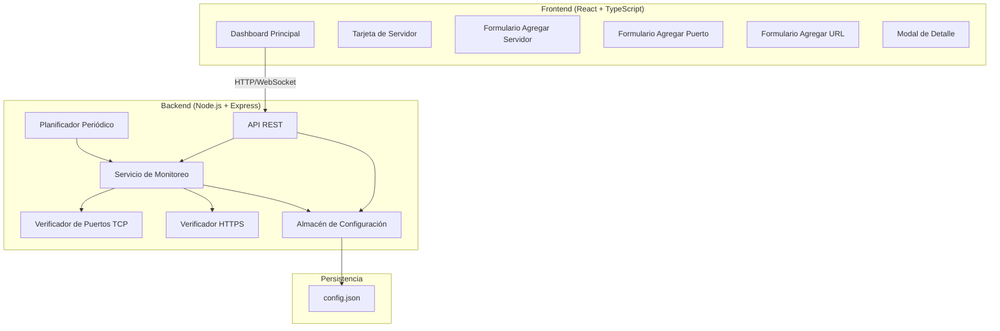
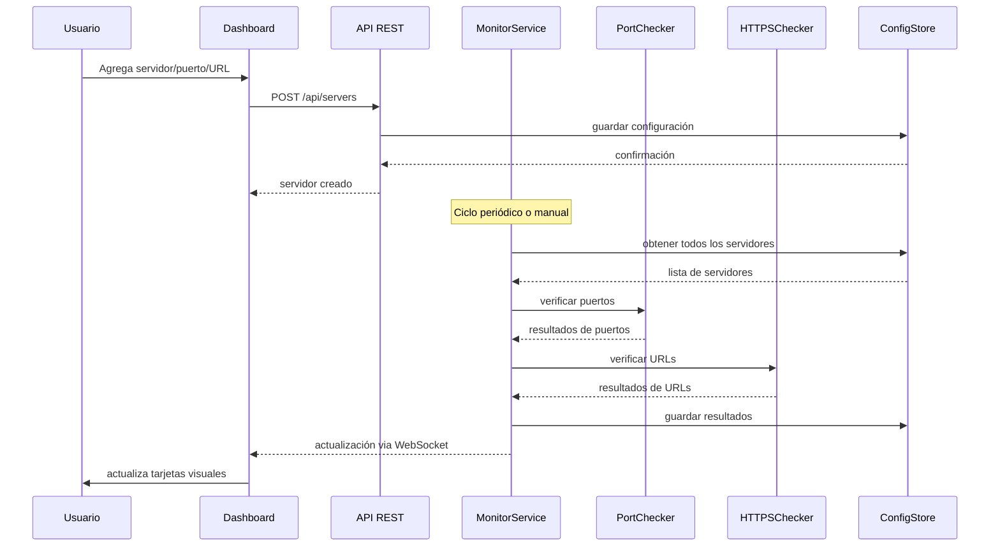

# Documento de Diseño: Monitor de Servidores e Infraestructura

## Descripción General

La aplicación es una herramienta web de monitoreo de infraestructura que permite a los administradores de sistemas verificar en tiempo real el estado de puertos TCP y URLs HTTPS en sus servidores. Cuenta con un dashboard visual interactivo que muestra el estado consolidado (OK / Alerta) de cada servidor registrado.

La aplicación se construye como una aplicación web full-stack con:
- **Frontend**: React + TypeScript con Tailwind CSS para el dashboard visual
- **Backend**: Node.js + Express con TypeScript para la API REST y los verificadores
- **Persistencia**: Archivo JSON local (configurable a SQLite para mayor robustez)
- **Monitoreo**: Verificaciones TCP nativas de Node.js y solicitudes HTTP/HTTPS con `axios`

---

## Arquitectura



### Flujo de Datos Principal



---

## Componentes e Interfaces

### Backend

#### API REST

| Método | Ruta | Descripción |
|--------|------|-------------|
| GET | `/api/servers` | Obtener todos los servidores con su estado |
| POST | `/api/servers` | Agregar un nuevo servidor |
| DELETE | `/api/servers/:id` | Eliminar un servidor |
| POST | `/api/servers/:id/ports` | Agregar un puerto a un servidor |
| DELETE | `/api/servers/:id/ports/:port` | Eliminar un puerto de un servidor |
| POST | `/api/servers/:id/urls` | Agregar una URL a un servidor |
| DELETE | `/api/servers/:id/urls/:urlId` | Eliminar una URL de un servidor |
| POST | `/api/monitor/check/:id` | Verificación manual de un servidor |
| POST | `/api/monitor/check-all` | Verificación manual de toda la infraestructura |
| GET | `/api/settings` | Obtener configuración del intervalo |
| PUT | `/api/settings` | Actualizar intervalo de monitoreo |

#### Interfaces TypeScript (Backend)

```typescript
interface Servidor {
  id: string;
  nombre: string;
  host: string; // IP o hostname
  puertos: number[];
  urls: UrlMonitoreada[];
  estado: EstadoServidor;
  ultimaVerificacion: string | null; // ISO 8601
  creadoEn: string; // ISO 8601
}

interface UrlMonitoreada {
  id: string;
  url: string;
  estado: EstadoUrl;
  codigoHttp: number | null;
  errorCertificado: boolean;
  ultimaVerificacion: string | null;
}

interface ResultadoPuerto {
  puerto: number;
  estado: 'abierto' | 'cerrado' | 'sin_respuesta';
  latenciaMs: number | null;
}

type EstadoServidor = 'ok' | 'alerta' | 'desconocido';
type EstadoUrl = 'disponible' | 'no_disponible' | 'error_certificado' | 'desconocido';

interface ConfiguracionApp {
  intervaloMonitoreoSegundos: number; // 30 - 3600
}

interface ResultadoVerificacion {
  servidorId: string;
  timestamp: string;
  puertos: ResultadoPuerto[];
  urls: ResultadoUrlVerificacion[];
  estadoGeneral: EstadoServidor;
}

interface ResultadoUrlVerificacion {
  urlId: string;
  url: string;
  estado: EstadoUrl;
  codigoHttp: number | null;
  errorCertificado: boolean;
  latenciaMs: number | null;
}
```

#### VerificadorPuertos

```typescript
class VerificadorPuertos {
  // Timeout máximo: 5000ms
  async verificarPuerto(host: string, puerto: number): Promise<ResultadoPuerto>
  async verificarPuertos(host: string, puertos: number[]): Promise<ResultadoPuerto[]>
}
```

#### VerificadorHTTPS

```typescript
class VerificadorHTTPS {
  // Timeout máximo: 10000ms
  async verificarUrl(url: string): Promise<ResultadoUrlVerificacion>
  async verificarUrls(urls: UrlMonitoreada[]): Promise<ResultadoUrlVerificacion[]>
}
```

#### ServicioMonitoreo

```typescript
class ServicioMonitoreo {
  async verificarServidor(servidorId: string): Promise<ResultadoVerificacion>
  async verificarTodos(): Promise<ResultadoVerificacion[]>
  iniciarMonitoreoPeriodicо(intervaloSegundos: number): void
  detenerMonitoreo(): void
}
```

### Frontend

#### Componentes React

```
src/
├── components/
│   ├── Dashboard.tsx          # Contenedor principal del dashboard
│   ├── ServerCard.tsx         # Tarjeta visual de servidor (OK/Alerta)
│   ├── ServerDetailModal.tsx  # Modal con detalle de puertos y URLs
│   ├── AddServerForm.tsx      # Formulario para agregar servidor
│   ├── AddPortForm.tsx        # Formulario para agregar puerto
│   ├── AddUrlForm.tsx         # Formulario para agregar URL
│   ├── StatusBadge.tsx        # Indicador visual de estado
│   ├── SummaryBar.tsx         # Barra de resumen global (OK/Alerta count)
│   └── SettingsPanel.tsx      # Panel de configuración de intervalo
├── hooks/
│   ├── useServers.ts          # Hook para gestión de servidores
│   └── useMonitor.ts          # Hook para operaciones de monitoreo
├── services/
│   └── api.ts                 # Cliente HTTP para la API REST
└── types/
    └── index.ts               # Tipos TypeScript compartidos
```

---

## Modelos de Datos

### Estructura de Persistencia (config.json)

```json
{
  "configuracion": {
    "intervaloMonitoreoSegundos": 60
  },
  "servidores": [
    {
      "id": "uuid-v4",
      "nombre": "Servidor Web Principal",
      "host": "192.168.1.10",
      "puertos": [80, 443, 8080],
      "urls": [
        {
          "id": "uuid-v4",
          "url": "https://miapp.empresa.com",
          "estado": "disponible",
          "codigoHttp": 200,
          "errorCertificado": false,
          "ultimaVerificacion": "2024-01-15T10:30:00Z"
        }
      ],
      "estado": "ok",
      "ultimaVerificacion": "2024-01-15T10:30:00Z",
      "creadoEn": "2024-01-01T00:00:00Z"
    }
  ]
}
```

### Lógica de Determinación de Estado del Servidor

El estado de un servidor se determina como:
- **`ok`**: Todos los puertos están "abierto" Y todas las URLs están "disponible"
- **`alerta`**: Al menos un puerto está "cerrado"/"sin_respuesta" O al menos una URL está "no_disponible"/"error_certificado"
- **`desconocido`**: No se ha realizado ninguna verificación aún

---

## Propiedades de Corrección

*Una propiedad es una característica o comportamiento que debe mantenerse verdadero en todas las ejecuciones válidas del sistema. Las propiedades sirven como puente entre las especificaciones legibles por humanos y las garantías de corrección verificables automáticamente.*

### Propiedad 1: Registro de servidor persiste y es recuperable

*Para cualquier* servidor con nombre y host válidos, después de registrarlo, debe aparecer en la lista de servidores recuperada del almacén de configuración con los mismos datos.

**Valida: Requisitos 1.1, 1.3**

---

### Propiedad 2: Eliminación de servidor es completa

*Para cualquier* servidor registrado con puertos y URLs asociados, después de eliminarlo, ni el servidor ni sus puertos ni sus URLs deben aparecer en el almacén de configuración.

**Valida: Requisitos 1.2**

---

### Propiedad 3: Rechazo de servidores duplicados

*Para cualquier* host (IP o hostname), si ya existe un servidor registrado con ese host, intentar registrar otro servidor con el mismo host debe resultar en un error y la lista de servidores no debe cambiar.

**Valida: Requisitos 1.4**

---

### Propiedad 4: Validación de puertos rechaza entradas inválidas

*Para cualquier* número entero fuera del rango [0, 65535], o para cualquier puerto ya registrado en un servidor, intentar agregarlo debe resultar en un error y la lista de puertos del servidor no debe cambiar.

**Valida: Requisitos 2.3, 2.4**

---

### Propiedad 5: Validación de URLs rechaza entradas inválidas

*Para cualquier* string que no sea una URL válida (sin protocolo http/https, malformada), o para cualquier URL ya registrada en un servidor, intentar agregarla debe resultar en un error y la lista de URLs del servidor no debe cambiar.

**Valida: Requisitos 3.3, 3.4**

---

### Propiedad 6: Clasificación de estado HTTP es exhaustiva y correcta

*Para cualquier* código de respuesta HTTP, si el código está en el rango [200, 399] el estado debe ser "disponible", y si el código es >= 400 el estado debe ser "no_disponible". Estos dos casos son mutuamente excluyentes y cubren todos los códigos HTTP posibles.

**Valida: Requisitos 5.2, 5.3**

---

### Propiedad 7: Renderizado de tarjeta refleja estado del servidor

*Para cualquier* servidor con estado "ok", el componente ServerCard debe aplicar estilos de color verde; para cualquier servidor con estado "alerta", debe aplicar estilos de color rojo/naranja. Los estilos son mutuamente excluyentes.

**Valida: Requisitos 7.2, 7.3**

---

### Propiedad 8: Conteo del resumen global es consistente

*Para cualquier* lista de servidores con estados mixtos, el conteo de servidores "ok" más el conteo de servidores "alerta" más el conteo de servidores "desconocido" debe ser igual al total de servidores registrados.

**Valida: Requisitos 7.5**

---

### Propiedad 9: Validación del intervalo de monitoreo

*Para cualquier* valor de intervalo fuera del rango [30, 3600] segundos, el sistema debe rechazarlo. Para cualquier valor dentro del rango, debe aceptarlo y aplicarlo.

**Valida: Requisitos 6.3, 6.4**

---

### Propiedad 10: Persistencia round-trip de configuración

*Para cualquier* configuración válida de servidores (con puertos y URLs), serializarla a JSON y luego deserializarla debe producir un objeto equivalente al original.

**Valida: Requisitos 1.3**

---

## Manejo de Errores

### Errores de Red (Verificación de Puertos)
- **Timeout TCP** (> 5s): Estado `sin_respuesta`, no se propaga como excepción
- **Conexión rechazada**: Estado `cerrado`
- **Host no resuelto**: Estado `sin_respuesta` con mensaje de error en logs

### Errores HTTP (Verificación de URLs)
- **Timeout HTTP** (> 10s): Estado `no_disponible`
- **Error de certificado SSL**: Estado `error_certificado` (se captura el error de TLS)
- **Código HTTP >= 400**: Estado `no_disponible` con código registrado
- **Error de red**: Estado `no_disponible`

### Errores de API
- **400 Bad Request**: Datos de entrada inválidos (host duplicado, puerto fuera de rango, URL inválida)
- **404 Not Found**: Servidor o recurso no encontrado
- **500 Internal Server Error**: Error inesperado del servidor (con logging)

### Estrategia de Resiliencia
- Las verificaciones fallidas no detienen el ciclo de monitoreo
- Cada servidor se verifica de forma independiente
- Los errores de un servidor no afectan la verificación de otros

---

## Estrategia de Pruebas

### Pruebas Unitarias

Se utilizará **Jest** con **ts-jest** para el backend y **Vitest** con **React Testing Library** para el frontend.

Casos de prueba unitarios clave:
- Validación de formato de URL (válidas e inválidas)
- Validación de rango de puertos (0-65535)
- Lógica de determinación de estado del servidor (ok/alerta/desconocido)
- Clasificación de códigos HTTP (200-399 → disponible, >=400 → no_disponible)
- Serialización/deserialización de configuración JSON

### Pruebas Basadas en Propiedades (Property-Based Testing)

Se utilizará **fast-check** para TypeScript/JavaScript, tanto en backend como en frontend.

Configuración: mínimo **100 iteraciones** por prueba de propiedad.

Cada prueba de propiedad debe estar anotada con el formato:
`// Feature: server-monitor, Property N: <texto de la propiedad>`

#### Pruebas de Propiedad Planificadas

**Propiedad 1** - Registro y recuperación de servidor:
```typescript
// Feature: server-monitor, Property 1: Registro de servidor persiste y es recuperable
fc.assert(fc.asyncProperty(
  fc.record({ nombre: fc.string(), host: fc.ipV4() }),
  async (datos) => {
    await store.agregarServidor(datos);
    const servidores = await store.obtenerServidores();
    return servidores.some(s => s.host === datos.host);
  }
), { numRuns: 100 });
```

**Propiedad 4** - Validación de puertos:
```typescript
// Feature: server-monitor, Property 4: Validación de puertos rechaza entradas inválidas
fc.assert(fc.property(
  fc.oneof(fc.integer({ max: -1 }), fc.integer({ min: 65536 })),
  (puerto) => {
    expect(() => validarPuerto(puerto)).toThrow();
  }
), { numRuns: 100 });
```

**Propiedad 6** - Clasificación de estado HTTP:
```typescript
// Feature: server-monitor, Property 6: Clasificación de estado HTTP es exhaustiva y correcta
fc.assert(fc.property(
  fc.integer({ min: 200, max: 399 }),
  (codigo) => clasificarEstadoHttp(codigo) === 'disponible'
), { numRuns: 100 });

fc.assert(fc.property(
  fc.integer({ min: 400, max: 599 }),
  (codigo) => clasificarEstadoHttp(codigo) === 'no_disponible'
), { numRuns: 100 });
```

**Propiedad 10** - Round-trip de configuración:
```typescript
// Feature: server-monitor, Property 10: Persistencia round-trip de configuración
fc.assert(fc.property(
  generadorConfiguracionValida(),
  (config) => {
    const serializado = JSON.stringify(config);
    const deserializado = JSON.parse(serializado);
    return deepEqual(config, deserializado);
  }
), { numRuns: 100 });
```

### Pruebas de Integración

- Flujo completo: agregar servidor → agregar puertos/URLs → ejecutar verificación → verificar estado en dashboard
- Verificación de que WebSocket emite actualizaciones cuando cambia el estado
- Verificación de persistencia entre reinicios simulados
