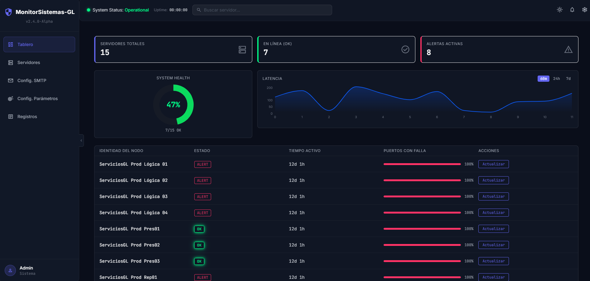

# Monitor de Servidores e Infraestructura


Aplicación web full-stack para monitorear en tiempo real el estado de puertos TCP y URLs HTTPS en servidores de infraestructura con una interfaz cyber-dark futurista.

## ✨ Características

- **Monitoreo en tiempo real** (TCP/HTTPS) vía WebSockets.
- **Alertas y notificaciones** por correo electrónico personalizables.
- **Visualización y configuración de umbrales de consumo de recursos reales** (CPU, RAM, Disco) extrayendo métricas mediante un agente ligero, desplegable tanto en Node.js como vía handler customizable en IIS (.NET Framework), soportando parametrización individual de URL por servidor.
- **Interfaz gráfica moderna** y responsiva, con soporte nativo para **Modos Cyber-Dark y SaaS Light (Claro)**.

### Tablero Principal


### Gestión de Servidores


## 🚀 Inicio rápido

```bash
# Instalar dependencias
npm run install:all

# Ejecutar backend (puerto 3001)
npm run dev:backend

# Ejecutar frontend (puerto 3000)
npm run dev:frontend

# Ejecutar todas las pruebas
npm test
```

## 🛠️ Stack Tecnológico

- **Backend**: Node.js + Express + TypeScript, WebSocket (`ws`)
- **Frontend**: React + TypeScript + Tailwind CSS + Vite
- **Persistencia**: JSON local (`backend/data/config.json`)
- **Testing**: Jest + fast-check (backend), Vitest + React Testing Library (frontend)

## 📚 Documentación

Para detalles profundos sobre el funcionamiento interno, dirígete a nuestros documentos:
- 📖 [Documentación Técnica (API, Arquitectura, WebSockets)](docs/DocumentacionTecnica.md)
- 📝 [Historial de Cambios (Changelog)](docs/CHANGELOG.md)

## 📄 Licencia y Contacto

- **Licencia:** Proceso y código de uso privado / Todos los derechos reservados.
- **Autor/Contacto:** Marvin Lemus Torres ([@Marvinilt](https://github.com/Marvinilt))
