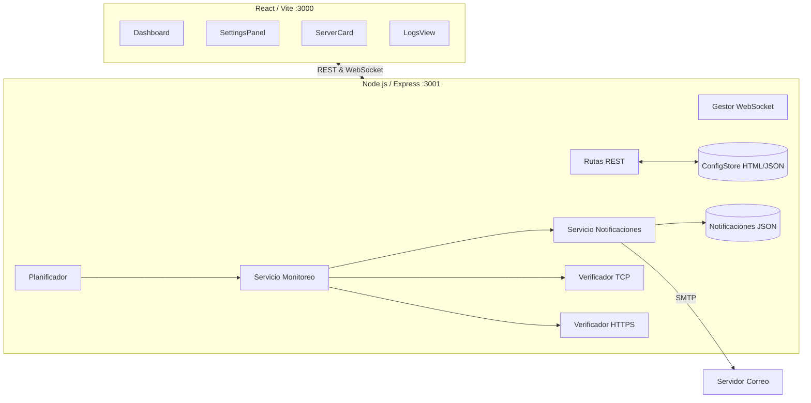

# Documentación Técnica — Monitor de Servidores e Infraestructura

Esta documentación describe la arquitectura unificada y el funcionamiento actual del sistema de monitoreo. Para la revisión de cambios históricos, características por versión y evolución general, consulte el archivo [CHANGELOG.md](../CHANGELOG.md).

## 1. Visión General y Arquitectura Global

El proyecto es una aplicación full-stack diseñada para monitorear en tiempo real puertos TCP y URLs HTTPS de servidores en la infraestructura, presentados con un dashboard temático "Cyber-Dark". 

El sistema garantiza operaciones atómicas al recuperar/almacenar datos, tolerancia a fallos en caso de caídas de red y persistencia deduplicada para evitar inundar a los administradores con correos electrónicos repetidos.



## 2. Modelos de Datos Centrales

El sistema se basa en las siguientes estructuras clave, persistidas en el backend y compartidas estáticamente (mediante interfaces TypeScript) con el frontend.

### Servidor y Resultados
```typescript
interface Servidor {
  id: string;             // UUID
  nombre: string;         // Renombrable vía PATCH
  ip: string;
  puertos: number[];      // Rango válido [0, 65535]
  urls: URLMonitor[];
  resultadosPuertos: ResultadoPuerto[]; // Último estado procesado (Persistido)
  estadoGlobal: 'ok' | 'alerta' | 'desconocido'; 
}

interface ResultadoPuerto {
  puerto: number;
  estado: 'abierto' | 'cerrado' | 'sin_respuesta';
  latenciaMs: number | null;
}

interface URLMonitor {
  id: string;
  url: string;            // Formato válido HTTP/HTTPS
  estado: 'disponible' | 'no_disponible' | 'error_certificado' | 'desconocido';
  codigoHttp?: number;    // Verde (<400), Rojo (>=400)
}
```

### Configuración SMTP y Alertas
```typescript
interface ConfiguracionEmail {
  habilitado: boolean;
  smtpHost: string;
  smtpPuerto: number;
  smtpUsuario: string;
  smtpPassword: string;
  remitente: string;
  destinatarios: string[]; // Arreglo, mínimo 1 correo válido (RFC 5322)
}

interface CambioEstado {
  recursoId: string;
  tipoRecurso: 'servidor' | 'puerto' | 'url';
  nombreRecurso: string;
  estadoAnterior: string;
  estadoNuevo: string;
  timestamp: string; // ISO 8601
  servidorId: string;
  servidorNombre: string;
}
```

## 3. Componentes del Backend (Core Engine)

### 3.1. Motor de Monitoreo
La orquestación del escaneo se divide en tres actores operativos:

1. **`Planificador`**: Ejecuta `setInterval` basándose en el parámetro configurable del sistema (entre 30s y 3600s). Esta capa actúa como "Catch-All", interceptando y suprimiendo errores graves para que el ciclo de vida del proceso de Node.js nunca caiga.
2. **`ServicioMonitoreo`**: Gestiona verificaciones asíncronas en paralelo (`Promise.all()`).  
   - **Lógica de Priorización:** Evalúa primeramente el HTTPS. Si una máquina no expone puertos TCP internos (ya sea por limitación de VLAN, DMZ o Firewall) pero la suma de **todas sus URLs asignadas responden `disponible`**, el motor descarta el fallo TCP y asigna dinámicamente el estado padre como `ok`.
   - **Monitoreo de Recursos SImulado:** Agregada lógica complementaria para consultar el estado del hardware simulado (consumo de CPU, Memoria RAM y Disco duros). Si estas mediciones superan sus umbrales definibles por el usuario, el servicio de monitoreo lo detecta y lo notifica.
3. **Verificadores**:
   - `VerificadorPuertos`: Emplea la interfaz nativa `net.createConnection()` con un umbral estricto de timeout (5 segundos).
   - `VerificadorHTTPS`: Emplea la librería `axios`. Por defecto, simula cabeceras Web de navegador estándar (`User-Agent` de Chrome) para sortear restricciones tipo 403 provocadas por **Web Application Firewalls (WAF) genéricos**. Adicionalmente, asume intencionalmente los códigos HTTP `401` y `403` como **disponibles**, bajo la premisa que existe un servicio web funcional pero que simplemente deniega el paso sin el header de autenticación adecuado.

### 3.2. Sistema de Notificaciones (SMTP)
Cuando el modulo `ServicioMonitoreo` detecta una transición real de estado:
1. Deriva de forma asíncrona la tupla (Estado Anterior -> Estado Nuevo) a la función `ServicioNotificaciones.procesarResultado()`.
2. Se genera un array tipo `CambioEstado` que, previo al envío de correo electrónico, se compara de forma lógica en el `RegistroNotificaciones` interno.
3. Si el registro existe (usando la clave compuesta de persistencia `${recursoId}:${estadoAnterior}:${estadoNuevo}`), se detiene el flujo como medida de deduplicación (anti-spam). 
4. Si es inédito, mediante `nodemailer`, se consolida un lote (Batch) de alertas y se construye un template HTML en vivo para inyectarlo en la tubería SMTP.
5. Emplea la configuración `dns.lookup()` habilitada desde el Transporter para garantizar soporte operativo en redes locales Intranet con nombres de dominio declarados explícitamente en el archivo `/etc/hosts`.

### 3.3. Persistencia
Operaciones atómicas manejadas por `ConfigStore.ts` y grabadas en estructuras JSON puras. Todo el tráfico pasa antes por validaciones unitarias en memoria (para rechazar duplicados) asegurando integridad antes de confirmar la promesa de I/O a disco.

## 4. Componentes del Frontend (UI Cyber-Dark / SaaS Light)

Estructurada internamente sobre **React.js + TailwindCSS + Vite.js**, usando principios Glassmorphism, animaciones y esquemas modulares, e integrando además **un rediseño de Modo Claro accesible a través de un toggle de persistencia**:

- **`Dashboard` (Contenedor Maestro):** Orquestador de vistas laterales basado en pestaña colapsable (`Sidebar`). Mantiene reactividad total en los cálculos matemáticos para resumir rápidamente incidencias (ej. Indexado de Puertos en Fallo) representadas en anillos SVG dinámicos. Incluye bloqueo preventivo de la interfaz (`isChecking`) cuando detecta una validación asíncrona viva con el backend.
- **`ServerCard`:** El "widget" atómico. Brinda feedback del backend sin necesidad de accionar componentes adicionales. Emite renderizados condicionales (`box-shadow glow-success` vs `glow-danger`) e instancia listados renderizados al vuelo en formato LED para asimilar equipos de red físicos (Puntos TCP, URLs disponibles + códigos HTTP, avisos 🔒 SSL expirados, y estado % en vivo de CPU, RAM y Disco con alertas dinámicas).
- **`ServerDetailModal`:** Panel de información profundo renderizado sobre efecto de desenfoque (`backdrop-blur`). Incorpora mecanismos avanzados *in-place-editing* mutando la lectura pasiva a cajas `input` directas para edición ágil del nombre del entorno.
- **`LogsView`:** Lector nativo en forma tabulada consumiendo crudos limpios desde `notifications.json`. Presenta badges basados en severidad para facilitar las tareas de auditoría en auditorías NOC (Network Operations Centers).
- **`ParametersView`:** Nuevo módulo interactivo (`Config. Parámetros`) dedicado a definir, reajustar y persistir los umbrales límite bajo los cuales el Motor de Monitoreo evalúa la severidad de los recursos reportados por los servidores.

## 5. Estrategia de Pruebas (Test Suite)

Las pruebas previenen directamente las regresiones apoyándose en el paradigma *Property-Based Testing* ejecutando cientos de permutaciones estresantes de Data en base a propiedades declaradas.

| Módulo/Servidor              | Enfoque de la Propiedad                                                                                                                                                                   | Herramienta                              |
| ---------------------------- | ----------------------------------------------------------------------------------------------------------------------------------------------------------------------------------------- | ---------------------------------------- |
| **Motor Estructural**        | Resistencia a Colisión por Identidad (Servidores duplicados rechazados)                                                                                                                   | `fast-check` y `jest`                    |
| **Parsing**                  | Verificación estricta del limite binario en TCP [0 - 65535]. Rechaza texto malicioso.                                                                                                     | `fast-check`                             |
| **Manipulación (CRUD)**      | Eliminación en Cascada limpia integralmente cualquier referencia (Huérfanos eliminados).                                                                                                  | `fast-check`                             |
| **Confiabilidad Asíncrona**  | Transiciones idénticas de red resuelven SIEMPRE en flag `yaNotificado=true` sin accionar el SMTP local (Hard Bounce Preventer).                                                           | `fast-check`                             |
| **Saneamiento SMTP**         | Componentes validan las cabeceras bajo formato RFC 5322 en correos destino antes del spooler de correo.                                                                                   | `fast-check` y Regex                     |
| **Motor Gráfico (UI/React)** | Propiedades semánticas de clase y paleta inyectan el CSS puro requerido para representar visualmente fallas con semáforos rojos / verdes nativos sin manipulación engañosa de datos base. | `RTL (@testing-library)` y  `fast-check` |

---

## ANEXO: Referencia Rápida de API e Interactividad

### Interfaz WebSockets

Conexión base hacia Endpoint `ws://localhost:3001/ws`.  
Eventos estandarizados en la capa de transmisión continua:
- `server-update`: Disparado individualmente cuando el motor termina con un Nodo.
- `check-progress`: Enviado constantemente. Informa el progreso y dictamina bloqueos condicionales si los usuarios pulsan salvajemente el botón maestro del frontend.

### Directorio Root en Entorno Dev

```
server-monitor/
├── backend/          
│   └── src/
│       ├── api/      # Rutas HTTPS/Express y WS Routing
│       ├── checkers/ # Capas TCP & Protocol HTTP Client Fetchers
│       ├── services/ # Orquestadores: SMTP, Monitors y Timers.
│       ├── store/    # Sistema CRUD/Atomic Database JSON.
│       └── types/    # TS Interfaces Contractuales globales.
└── frontend/         
    └── src/
        ├── components/ # Widgets Cyber-Dark. Modales. Inputs atómicos.
        ├── hooks/      # Encapsulamiento Fetcher Local
        ├── services/   # Consumidores API Axios pre-configurados.
        └── types/      # Equivalente Types.
```
